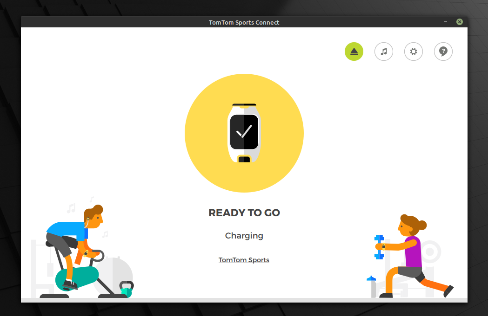

# TomTom Sports Connect(Ubuntu 20.04/Mint 20) 

Guide to install TomTom Sports Connect on 64-bit Ubuntu 20.04 or Mint 20. 

Edit this file `/etc/apt/sources.list` and add this line to the end of it.

`deb http://security.ubuntu.com/ubuntu bionic-security main`

Install required packages: 
`sudo apt update && apt-cache policy libssl1.0-dev` 
`sudo apt install wget libssl1.0-dev libgl1-mesa-glx`

Download tomtom app and dependencies: 
`wget https://sports.tomtom-static.com/downloads/desktop/mysportsconnect/latest/tomtomsportsconnect.x86_64.deb` 
`wget http://archive.ubuntu.com/ubuntu/pool/universe/g/gstreamer0.10/libgstreamer0.10-0_0.10.36-1.5ubuntu1_amd64.deb` 
`wget http://archive.ubuntu.com/ubuntu/pool/universe/g/gst-plugins-base0.10/libgstreamer-plugins-base0.10-0_0.10.36-2ubuntu0.2_amd64.deb` 

And install them: 
`sudo dpkg -i libgstreamer0.10-0_0.10.36-1.5ubuntu1_amd64.deb` 
`sudo dpkg -i libgstreamer-plugins-base0.10-0_0.10.36-2ubuntu0.2_amd64.deb` 
`sudo dpkg -i tomtomsportsconnect.x86_64.deb` 

You can run tomtom from start menu or terminal (for logs) with: 
`/usr/local/TomTomSportsConnect/bin/TomTomSportsConnect` 

It didn't work when you ran it as a regular user and you got "We could not connect to your watch". This is due to the invalid syntax  
of the udev rules in `/etc/udev/rules.d/tomtomsportsconnect.rules`.  
Indeed, there as some changes with the udev version in Ubuntu 20.04/Mint 20. So you have to update the file as following: 

    # TomTom Fitness Watch
    SUBSYSTEM=="usb", ATTRS{idVendor}=="1390", ATTRS{idProduct}=="7474", MODE="0666", GROUP="plugdev"
    # TomTom Fitness Watch
    SUBSYSTEM=="usb", ATTRS{idVendor}=="1390", ATTRS{idProduct}=="7475", MODE="0666", GROUP="plugdev" 
    # TomTom Fitness Watch (recovery)
    SUBSYSTEM=="usb", ATTRS{idVendor}=="1390", ATTRS{idProduct}=="7476", MODE="0666", GROUP="plugdev" 
    # TomTom Fitness Watch (no ms)
    SUBSYSTEM=="usb", ATTRS{idVendor}=="1390", ATTRS{idProduct}=="7477", MODE="0666", GROUP="plugdev" 
    # TomTom Activity Tracker
    SUBSYSTEM=="usb", ATTRS{idVendor}=="1390", ATTRS{idProduct}=="7480", MODE="0666", GROUP="plugdev" 
    # TomTom Fitness Watch
    SUBSYSTEM=="usb", ATTRS{idVendor}=="1390", ATTRS{idProduct}=="7485", MODE="0666", GROUP="plugdev" 
    # TomTom Fitness Watch (recovery)
    SUBSYSTEM=="usb", ATTRS{idVendor}=="1390", ATTRS{idProduct}=="7486", MODE="0666", GROUP="plugdev" 
    # TomTom Fitness Watch (no ms)
    SUBSYSTEM=="usb", ATTRS{idVendor}=="1390", ATTRS{idProduct}=="7487", MODE="0666", GROUP="plugdev"

Then, the udev rules have to be reloaded: 
`udevadm control --reload-rules && udevadm trigger`
